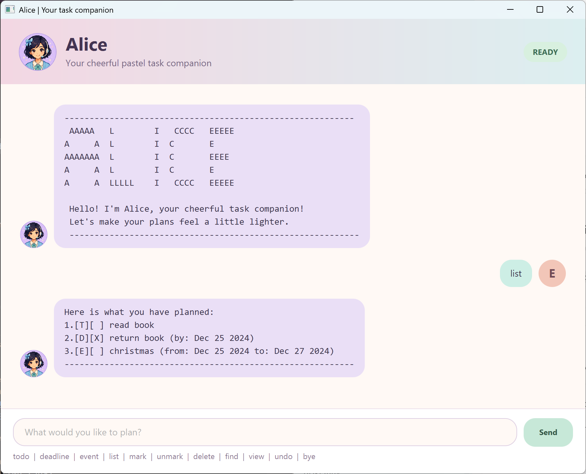

# Alice User Guide

Alice is a cheerful pastel task companion that helps you keep track of todos,
deadlines, and events through a simple chat interface.



## Quick start

1. Install Java 25 and confirm it is available by running `java -version`.
2. Download `Alice.jar` from the
   [latest GitHub release](https://github.com/Edison-choo/ip/releases).
3. Place the JAR file in a folder where Alice can keep her data.
4. Open a terminal in that folder and run:

   ```text
   java -jar Alice.jar
   ```

Alice automatically stores your tasks in `data/alice.txt` inside that folder.
You do not need to create or edit the file yourself.

## Command summary

Enter commands in lowercase. Dates use the `yyyy-MM-dd` format, such as
`2026-09-18`.

| Action | Command |
| --- | --- |
| Add a todo | `todo DESCRIPTION` |
| Add a deadline | `deadline DESCRIPTION /by DATE` |
| Add an event | `event DESCRIPTION /from START_DATE /to END_DATE` |
| Show all tasks | `list` |
| Mark a task as completed | `mark NUMBER` |
| Mark a task as not completed | `unmark NUMBER` |
| Delete a task | `delete NUMBER` |
| Find tasks | `find KEYWORD_OR_PHRASE` |
| View tasks on a date | `view DATE` |
| Undo the latest change | `undo` |
| Exit Alice | `bye` |

Task descriptions can contain up to 100 characters but cannot contain the `|`
character. Alice allows duplicate tasks and dates in the past.

## Adding tasks

### Adding a todo

Use `todo` for a task without a date.

```text
todo Read CS2103 notes
```

### Adding a deadline

Use `deadline` for a task that must be completed by a specific date.

```text
deadline Submit iP /by 2026-09-18
```

### Adding an event

Use `event` for something occurring over a date range. The end date may be the
same as the start date, but it cannot be earlier.

```text
event Project meeting /from 2026-09-16 /to 2026-09-16
```

## Managing tasks

### Listing tasks

Use `list` to see every saved task and its number.

```text
list
```

Alice uses `[T]` for todos, `[D]` for deadlines, and `[E]` for events. `[X]`
means a task is completed, while `[ ]` means it is not completed.

### Marking and unmarking

Use the number shown by `list` to update a task's completion status.

```text
mark 1
unmark 1
```

### Deleting a task

Use `delete` with the task number shown by `list`.

```text
delete 2
```

The remaining tasks are renumbered automatically.

### Undoing a change

Use `undo` to reverse the latest successful add, mark, unmark, or delete
command. You can undo several changes one at a time during the current session.

```text
todo Read textbook
undo
```

If there is no earlier change, Alice will let you know without changing the
task list.

## Finding and viewing tasks

### Finding tasks by description

Use `find` with a word or phrase. The search is case-insensitive and checks the
complete task description.

```text
find project meeting
```

### Viewing tasks on a date

Use `view` to show deadlines due on a date and events occurring on that date.

```text
view 2026-09-16
```

For multi-day events, Alice includes every date from the start date through the
end date.

## Exiting Alice

Enter `bye` to finish the session.

```text
bye
```

Alice displays a goodbye message, changes her status to `OFFLINE`, disables
further input, and closes automatically after five seconds.

## Input help

When a command cannot be processed, Alice displays the problem in a pink error
bubble and normally provides the correct format or an example. Check that:

- The command is written in lowercase.
- Required descriptions and task numbers are present.
- Dates use the `yyyy-MM-dd` format.
- Event end dates are not before their start dates.
- Task numbers come from the latest `list` output.

## Acknowledgements

This project was developed with assistance from OpenAI ChatGPT and Codex. The
project author provided the requirements, feature ideas, UI direction,
implementation preferences, and final decisions. AI was used extensively as an
implementation assistant to generate and refine portions of the JavaFX GUI,
tests, error handling, refactoring, build configuration, and documentation.

All AI-assisted work was directed, reviewed, adapted, and tested by the project
author.

The Alice profile image was generated using OpenAI's image-generation tool.
